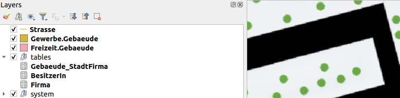

If a model or topic contains extended classes, the inclusive base classes are implemented in the physical database. The users only want to see, what is relevant for them and mostly work on the most extended instance of the topics/classes. Model Baker detects the ***irrelevant*** tables and offers optimization strategies to the users on ***smart1intehritance*** implementations.

In the [workflow wizard](../../user_guide/import_workflow/#optimize-qgis-project-if-extended) you can choose the optimization [strategy]([corresponding chapter](../../background_info/extended_models_optimization/#strategies) and receive a nicely prepared layertree and forms.

But what is done in the backend?

## Backend Sollution

### Assumptions

Since it's impossible to care for all the cases,  we need to make some assumptions what mostly would be the use case.

- When you extend a base class with the ***same name***, you intend to "replace" it, otherwise you would rename it.
- When you extend a base class ***multiple times*** (what you do with different names) then you intend to "replace" it.
- Exception for the two cases above: When you extended the class in the ***same model*** but another topic (because if you intent to "replace" it, you would have made it `ABSTRACT`).

### Conclusion
- Base classes with ***same named*** extensions are ***irrelevant***
- Base classes with ***multiple extensions*** are ***irrelevant***
- Except if the extension is in the ***same model***, then it's not **irrelevant** but will be ***renamed***

### And this means

A table is *irrelevant* when:

*We find the table as base class with same named extension in another model OR we find the table in the base class with multiple extensions in another topic but the same or the extended model.*

### Limitations
There are use case that cannot be handled, like for example:

- When a class is extended in another model (but not the one you import, but still a depending model, so it's imported as well) it could be irrelevant because of this, but still you would have needed it.
- When you extend a topic and have a not-extended base class referencing to a base class that has an extension, then the referenced base class will be irrelevant. But you might want it.

What to do then? Well, you have always the option for the [NONE-strategy](../../background_info/extended_models_optimization/#none-strategy).

## Strategies

Let's check out the following examle model and it's implementation according to the strategies.

### Ortsplanung Example

More or less real live example with 3 levels and multiple extensions. Level 2 (cantonal) extends level 1 (national) and level 3 (city) extends parts of level 2 and parts of level 1.

- `Ortsplanung_V1_1` using (not extending) `Infrastruktur_V1`.
- `Kantonale_Ortsplanung_V1_1` extending `Ortsplanung_V1_1` (TOPIC `Konstruktionen`).
- `Gewerbe_V1`.
- `Staedtisches_Gewerbe_V1` extending `Gewerbe_V1`.
- `Staedtische_Ortsplanung_V1_1` extending `Kantonale_Otsplanung_V1_1` (TOPIC `Konstruktionen`) and using `Staedtisches_Gewerbe_V1`.

See the models [below](../../background_info/extended_models_optimization/#example-models)...

#### Hide strategy
Base class layers with extensions of the same name are **_hidden_** and base class layers with multiple extensions **_also_**. Unless the extension is in the same model, then it's _**not hidden**_ but renamed.



Relations of hidden layers are **_not created_** and thus the widgets for them _**neither**_.

#### Group strategy

Base class layers with extensions of the same name are ***grouped***, base class layers with multiple extensions ***also***. Unless the extension is in the same model, then it's ***not grouped*** but ***renamed***.


Relationships of grouped layers are ***created***, but widgets are ***not applied*** to the form.

#### None strategy
Independently from extended models (but pretty much connected to it), we eliminate ambiguous layer naming in general. This means:

- If layername is ambiuous append topic name as suffix.
- If layername is still ambiguous append model name as suffix.


### Example Models

#### Level 1 (national)

```
INTERLIS 2.3;
/* Ortsplanung as national model importing the infrastrukture used for using geometry types and connectiong to strasse */
MODEL Ortsplanung_V1_1 (en) AT "https://modelbaker.ch" VERSION "2023-03-29" =
  IMPORTS Infrastruktur_V1;

  TOPIC Konstruktionen =
    DEPENDS ON Infrastruktur_V1.Strassen;

    CLASS Gebaeude  =
      Name : MANDATORY TEXT*99;
      Geometrie : MANDATORY Infrastruktur_V1.CHSurface;
    END Gebaeude;

    CLASS BesitzerIn =
      Vorname : MANDATORY TEXT*99;
      Nachname : MANDATORY TEXT*99;
    END BesitzerIn;

    ASSOCIATION Gebaeude_BesitzerIn =
      BesitzerIn -- {0..1} BesitzerIn;
      Gebaeude -- {0..*} Gebaeude;
    END Gebaeude_BesitzerIn;

    ASSOCIATION Gebaeude_Strasse =
      Strasse (EXTERNAL) -- {0..1} Infrastruktur_V1.Strassen.Strasse;
      Gebaeude -- {0..*} Gebaeude;
    END Gebaeude_Strasse;

  END Konstruktionen;

END Ortsplanung_V1_1.
```

```
INTERLIS 2.3;

/*National company register */
MODEL Gewerbe_V1 (en) AT "https://modelbaker.ch" VERSION "2023-03-29" =

  TOPIC Firmen =
    CLASS Firma =
      Name : TEXT;
    END Firma;
  END Firmen;

END Gewerbe_V1.
```

#### Level 2 (cantonal)

```
INTERLIS 2.3;

/* Extended Ortsplanung as cantonal model importing national model */
MODEL Kantonale_Ortsplanung_V1_1 (en) AT "https://modelbaker.ch" VERSION "2023-03-29" =
  IMPORTS Ortsplanung_V1_1;

  TOPIC Konstruktionen EXTENDS Ortsplanung_V1_1.Konstruktionen =
    CLASS Gebaeude  (EXTENDED)=
      Beschreibung: TEXT;
      Referenzcode: TEXT;

      !!@ ilivalid.msg = "Beschreibung and/or Referenzcode must be defined."
      SET CONSTRAINT DEFINED (Beschreibung) OR DEFINED (Referenzcode);
    END Gebaeude;
  END Konstruktionen;

END Kantonale_Ortsplanung_V1_1.
```

#### Level 3 (city)

```
INTERLIS 2.3;

/* Extended Ortsplanung as city model importing cantonal (and with this the national) model and the city extension of the gewerbe model (and with this the national gewerbe).*/
MODEL Staedtische_Ortsplanung_V1_1 (en) AT "https://modelbaker.ch" VERSION "2023-03-29" =
  IMPORTS Kantonale_Ortsplanung_V1_1, Staedtisches_Gewerbe_V1;

  !! Freizeit is an extension of the cantonal Konstruktionen (note that there is a constraint there)
  TOPIC Freizeit EXTENDS Kantonale_Ortsplanung_V1_1.Konstruktionen =
    OID AS INTERLIS.UUIDOID;

    CLASS Gebaeude (EXTENDED) =
      Unterhaltungsart : TEXT*99;
      istGeheim: BOOLEAN;
      !!@ ilivalid.msg = "Beschreibung needed when top secret."
      SET CONSTRAINT WHERE istGeheim:
        DEFINED (Beschreibung);
    END Gebaeude;
  END Freizeit;

  !! Gewerbe is an extension of the cantonal Konstruktionen (note that there is a constraint there)
  TOPIC Gewerbe EXTENDS Kantonale_Ortsplanung_V1_1.Konstruktionen =
    OID AS INTERLIS.UUIDOID;
    DEPENDS ON Staedtisches_Gewerbe_V1.Firmen;

    CLASS Gebaeude (EXTENDED) =
      Nutzungsart : TEXT*99;
    END Gebaeude;

    ASSOCIATION Gebaeude_StadtFirma =
      StadtFirma (EXTERNAL) -- {0..*} Staedtisches_Gewerbe_V1.Firmen.Firma;
      Gebaeude -- {0..*} Gebaeude;
    END Gebaeude_StadtFirma;

  END Gewerbe;

END Staedtische_Ortsplanung_V1_1.
```

```
INTERLIS 2.3;

/*Extended Gewerbe as city model importing the national model */
MODEL Staedtisches_Gewerbe_V1 (en) AT "https://modelbaker.ch" VERSION "2023-03-29" =
  IMPORTS Gewerbe_V1;

  TOPIC Firmen EXTENDS Gewerbe_V1.Firmen =
    OID AS INTERLIS.UUIDOID;

    CLASS Firma (EXTENDED)=
      EthischeBeurteilung : TEXT;
      !!@ ilivalid.msg = "Needs an ethical evaluation (EthischeBeurteilung)"
      SET CONSTRAINT DEFINED (EthischeBeurteilung);
    END Firma;
  END Firmen;

END Staedtisches_Gewerbe_V1.
```
