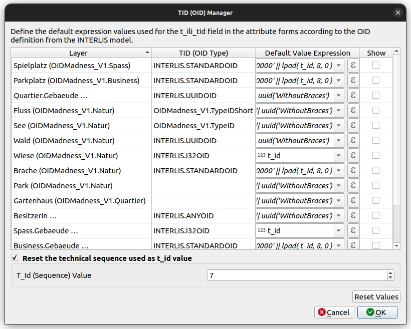

## OID, TID, BID, t_ili_tid, tid... Sorry, what?

Often the models definition requires a cross-system unique identificator. The so called **OID**.

```
[...]
  TOPIC Constructions =
    BASKET OID AS INTERLIS.UUIDOID;
    OID AS INTERLIS.STANDARDOID;
[...]
```

### In the data transferfile (`xtf`-file)...

... the OID of the *basket* is named `BID`

... the OID of the *objects* is named `TID`

```xml
<City_V1.Constructions BID="7dc3c035-b281-412f-9ba3-c69481054974">
  <City_V1.Constructions.Buildings TID="chMBAKER00000100"><Street>Rue des Fleures</Street><Number>1</Number></City_V1.Constructions.Buildings>
  <City_V1.Constructions.Buildings TID="chMBAKER00000101"><Street>Rue des Fleures</Street><Number>2</Number></City_V1.Constructions.Buildings>
```

### In the physical schema...

... those OIDs are written to the column `t_ili_tid`.

... while the `t_id` column contains just a ***schema-internal*** sequence used for foreign keys etc. Those `t_id`s are ***not*** the cross-system unique identificator.


!!! Note
    There are situations when that you can find the `t_id` as `TID` in your data. It's when there is no `t_ili_tid` available ili2db could use. But be aware those `TID`s are not stable OIDs then.

### OID Domains

There are different types of OID domains. In Model Baker we try to set default values that fit into the definition.

- UUIDOID
- I32OID
- STANDARDOID
- ANYOID
- User defined OID

#### `UUIDOID`

It's defined as `OID TEXT*36` and needs to be an [Universally Unique Identifier (UUID)](https://datatracker.ietf.org/doc/html/rfc4122). While the probability that a UUID will be duplicated is not zero, it is generally considered close enough to zero to be negligible.

In the QGIS Project the default value expression for `t_ili_tid` is therefore this:
```
uuid('WithoutBraces')
```

#### `I32OID`

It's defined as `OID 0 .. 2147483647` what means it needs to be a positive 4 byte integer value.

As a counter we take the one provided by the `t_id` sequence.

In the QGIS Project the default value expression for `t_ili_tid` is therefore this:

```
t_id
```

#### `STANDARDOID`

It's defined as `OID TEXT*16` and follows some specific requirements.

It requires an 8 char prefix and 8 char postfix:

- **Prefix (2 + 6 chars):** Country identifier + a *global identification part*. The global identification part can be ordered from the [official authority](https://www.interlis.ch/dienste/oid-bestellen)

- **Postfix (8 chars):** Sequence (numeric or alphanumeric) of your system as *local identification part*

Model Baker does not know what your *global identification part* is and uses a placeholder-prefix `%change%`. It's important that replace this part with your own prefix.

As *local identification part* Model Baker suggests the counter provided by the `t_id` sequence.

In the QGIS Project the default value expression for `t_ili_tid` is therefore this:

```
'%change%' || lpad( T_Id, 8, 0 )
```

#### `ANYOID`

The `ANYOID` does not define a format of the OID but just that an OID needs to be defined in all the extended models. This domain is only used on topics that need to be extended. This solution has some [limitations](#limitations).

#### User defined OIDs and not defined OIDs

For user defined OIDs or when OIDs are not defined, Model Baker tries to suggest something reasonable.

If there is no definition with OID AS, ili2db assumes TEXT and therefore they need to fulfill the rules of the XML-ID-type. This means the **first character** must be a **letter or underscore**, followed by letters, numbers, dots, minus signs, underscores; no colons (!), see [www.w3.org/TR/REC-xml](http://www.w3.org/TR/REC-xml).

In the QGIS Project the default value expression for `t_ili_tid` is therefore this:

```
'_' || uuid('WithoutBraces')
```

#### Summary
| OID domain | Suggested default value expression |
|---|---|
| INTERLIS.UUIDOID |  `uuid('WithoutBraces')`  |
| INTERLIS.I32OID | `t_id` |
| INTERLIS.STANDARDOID |  `'%change%' \|\| lpad( t_id, 8, 0 )` |
| INTERLIS.ANYOID | `'_' \|\| uuid('WithoutBraces')` |
| City_V1.TypeID | `'_' \|\| uuid('WithoutBraces')` |
| not defined | `'_' \|\| uuid('WithoutBraces')` |

### OID Manager

Since the user has to be able to edit those values, they are provided in the GUI.

Additionally to the [page implemented in the wizard](../../user_guide/import_workflow/#tid-oid-values) the configuration of the OIDs can be made on existing QGIS Projects.

Find the **OID Manager** via the *Database > Model Baker* menu.



Here you can use the QGIS Expression Dialog to edit the default value expression for the `t_ili_tid` field of each layer.

If you want to have the `t_ili_tid` exposed to the form, you can select ***Show***.

If you need a counter in the expressions, you can use the `t_id` field, that has a schema-wide sequence counting up. This sequence can be reset as well by the user, but be careful not to set it lower than already existing `t_id`s in your project. See below the [limitations](#limitations).

### Limitations

This solution covers a lot, but not everything.

#### ANYOID

If a class is designed in a topic with an OID definition `ANYOID` and it's extended in multiple other topics with other OID definitions, we cannot say what should be the default value, since it could divert depending in what basket you work.

#### OIDs on another system

When the OIDs are not UUIDs but e.g. `STANDARDOID`s instead, it's not possible to know in a system, wheter in other systems the same OIDs are generated. This means it's in the responsibility of the user to set the expressions (and the counters) in a way, that they don't conflict with OIDS of object generated some where else.

#### T_Id conflicts

When resetting the T_Id (Sequence) value one needs to be careful, because it's used for the technical sequence id (used for foreign keys etc.) as well. This means it should not conflict with the `t_id`s of objects already existing. That's why it should only be decreased if you really know what you are doing.

The conflicts are handled differently depending on the database system. On PostgreSQL you would encounter a duplicate key violation while on GeoPackage it would take the next available autogenerated t_id, but since it's not known on creating the OID it would break those values (e.g. write to it `chMBakerAutogene` instead of e.g. `chMBaker00000042`.)
