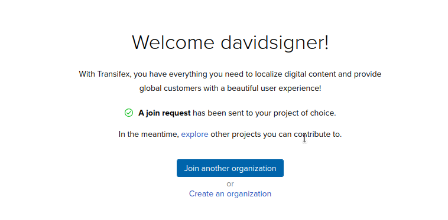

This project (Plugin and documentation) can be translated into any language.

Your language is missing? Feel free to contribute!

# How to get started

1. Log in to [Transifex](https://app.transifex.com/)

    Then go to *Join another organization*

2. In the search mask, enter “qgis model baker”. You will be taken to [this page](https://explore.transifex.com/search/?q=model%20baker)

    

3. Select the project you want to translate and select *Join this project*, you will be taken back to your dashboard:

    

    Now someone from OPENGIS.ch must accept. If nothing happens, it's best to write an e-mail.

4. If your request has been accepted, the projects are available to you:

    

5. You are ready to go. Select *Translate*

    

6. And now you can translate.

    
