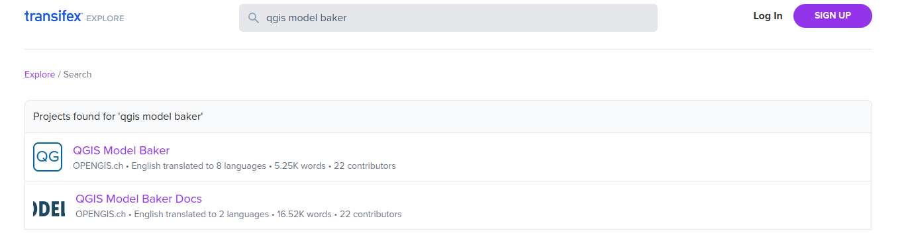
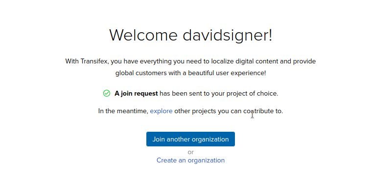
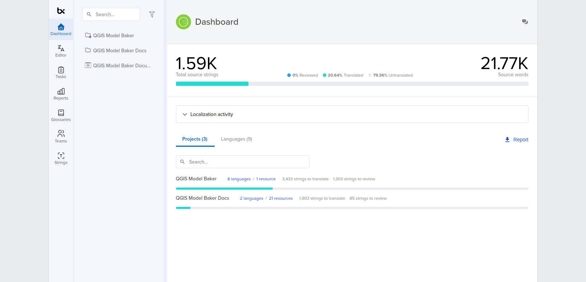
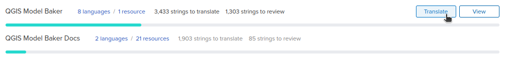
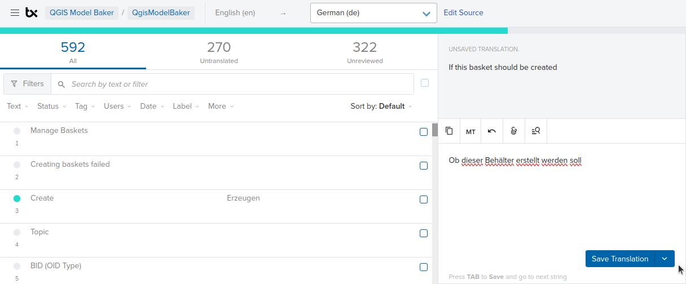
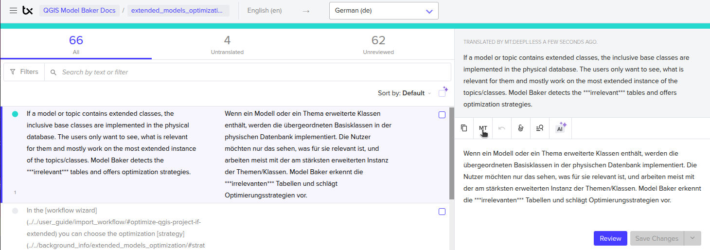
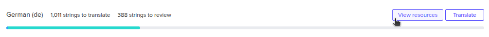
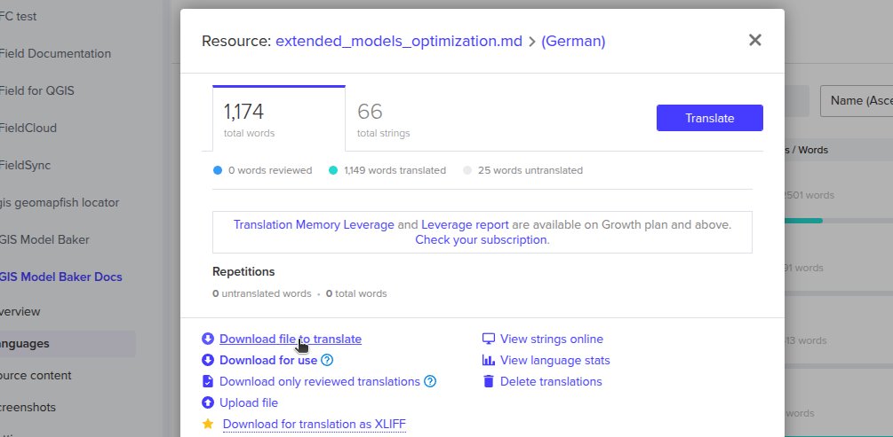
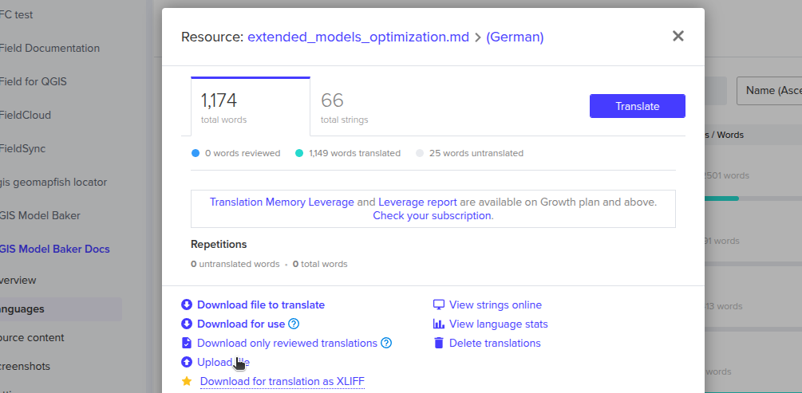

This project (Plugin and documentation) can be translated into any language.

Your language is missing? Then feel free to contribute!

## How to get started

1. Log in to [Transifex](https://app.transifex.com/)

    Then go to *Join another organization*

2. In the search mask, enter “qgis model baker”. You will be taken to [this page](https://explore.transifex.com/search/?q=model%20baker)

    

3. Select the project you want to translate and select *Join this project*, you will be taken back to your dashboard:

    

    Now someone from OPENGIS.ch must accept. If nothing happens, it's best to write an e-mail.

4. If your request has been accepted, the projects are available to you:

    

5. You are ready to go. Select *Translate*

    

6. And now you can translate.

    

## The little helpers

Transifex offers AI features, but they require an enterprise account.

However, you can use other options to use the little helpers.

1. Machine Translation (like DeepL etc) translates without the full context.
2. Translate documentation in VS Code with Copilot and Claude, then upload it again.

### Machine Translation

When you want to have your text translated by Machine Translation, klick on the MT button:

After that, you can still edit it and review it.

### AI use

You can take the original Markdown file from the repository or download it from Transifex.

1. Go to *Resources*:

2. Download the file you want to translate:

3. Translate it with your preferred AI tool, such as VS Code with integrated Copilot.

    Use this prompt:
    > Translate the body texts into German.
    > Keep code blocks, links and image references unchanged.
    > Do not add or remove any information. Keep it as literal as possible.
    > Use INTERLIS documentation style.
    > Address users as "du" and use a colon for gender-neutral language.
    > For parts that are already translated, do not change the wording. Only fix typos, etc.
    > And don't use the "sharp s" (ß) and keep the english quotes.
    > "!!!Note" is a MkDocs keyword and should not be translated.
    > Thank you.

    Some AI models do not edit published content in place, but others do.

4. Upload the translated file:

5. Review the translation. Do not trust the AI completely.

### Comparison:

Here is an example what MT or AI translated

#### Original:
> If a model or topic contains extended classes, the physical database implements the inclusive base classes. Users only want to see what is relevant to them, and they mostly work on the most extended instance of the topics or classes. Model Baker detects ***irrelevant*** tables and offers optimization strategies.

#### MT:
> Wenn ein Modell oder ein Thema erweiterte Klassen enthält, werden die übergeordneten Basisklassen in der physischen Datenbank implementiert. Die Nutzer wollen nur das sehen, was für sie relevant ist, und arbeiten meist mit der am stärksten erweiterten Instanz der Themen/Klassen. Model Baker erkennt die ***irrelevanten*** Tabellen und schlägt Optimierungsstrategien vor.

#### AI:
> Wenn ein Modell oder Topic erweiterte Klassen enthält, werden die inklusiven Basisklassen in der physischen Datenbank implementiert. Die User:innen wollen nur sehen, was für sie relevant ist, und arbeiten meist auf der am stärksten erweiterten Instanz der Topics/Klassen. Model Baker erkennt die ***irrelevanten*** Tabellen und bietet Optimierungsstrategien an.

### Pros and cons of AI:

- AI translates better (more literal and follows INTERLIS, "du" and gendered rules) than MT
- AI is more efficient for an entire file

But...

- You must check both
- The AI workflow takes more effort because of downloading and uploading
- You need an AI subscription (which not all contributors have)
- Claude AI will not translate the Model Baker documentation files because it's matched public code (Gemini AI will)

### Conclusion:

MT is more efficient for single strings, while AI is more efficient for entire files.
