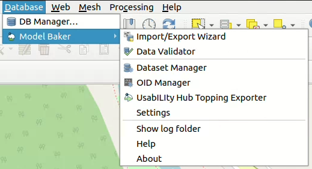
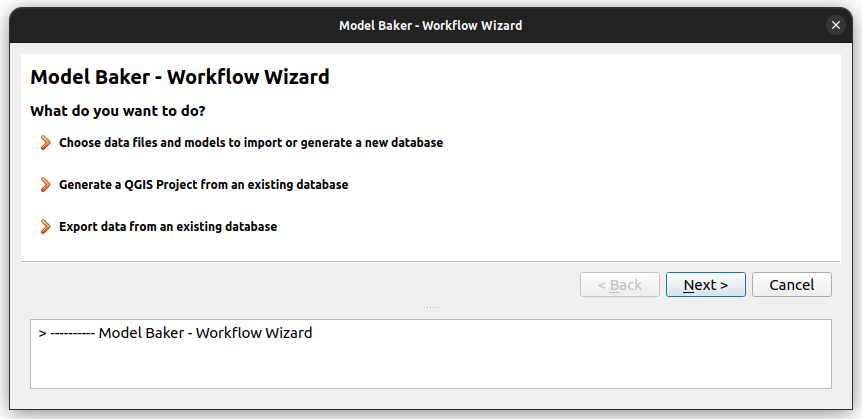
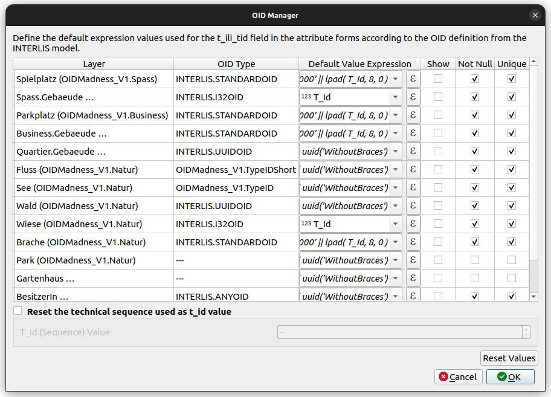
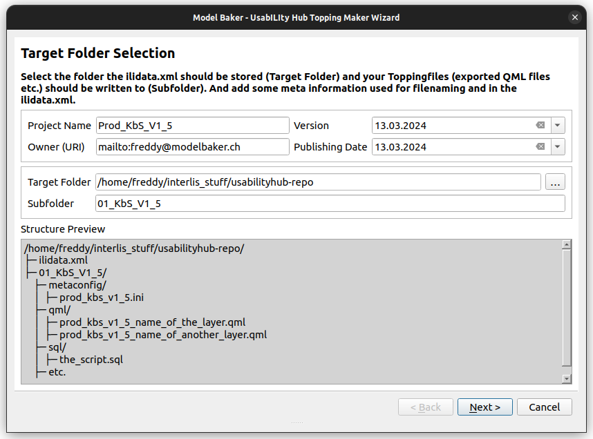
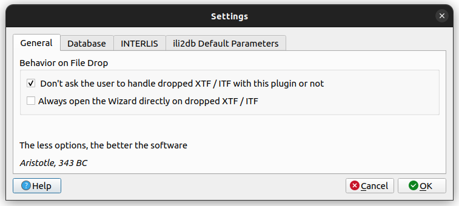
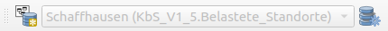

## Installation

1. [Install QGIS 3](https://qgis.org/en/site/forusers/download.html)

2. Use the plugin manager to install the "Model Baker" plugin.

    

## The Model Baker Functionalities

After the installation you can find all the Features in the *Database > Model Baker* menu.

### Import / Export Wizard

The wizard contains all the functionalities to create database schemas from INTERLIS models, import / export transferdata and generate QGIS projects from the database. It leads you through the process with all the possiblities you have with the single dialogs.

Find a guide through the [import and generate process with the wizard](../import_workflow/) and through the [export process with the wizard](../export_workflow/) in this documentation.

### Data Validator

The Data Validator provides you the possiblity to check the data currently open in your QGIS against an INTERLIS model. You can open the validator panel as well over *View > Panels > Model Baker Data Validator*.

See for more information about it [Validate Data](../user_guide/validation.md)

### Dataset Manager

The dataset manager provides you the possiblity to create and rename datasets and generate the baskets for the datasets.

More information you can find in the [Dataset and Basket Handling](../background_info/basket_handling.md)

### OID Manager

With the OID Manager you can view and set the handling of the OIDs in the current project like the default value expressions and their visibility.

Find further information about [OIDs in general and the OID Manager](../background_info/oid_tid_generator.md)

### UsabILIty Hub Topping Exporter

In case you plan to create your own [UsabILIty Hub](../background_info/usabilityhub/modelbaker_integration.md) topping set, then you can use the [UsabILIty Hub Exporter](../background_info/usabilityhub/topping_exporter.md).

### Settings

In keeping with aristotle, unnecessary settings are avoided. Still there are some. Find it in [Plugin Configuration](plugin_configuration.md).

### Show Log Folder

To view all Model Baker or ili2db logs, view the files in the corresponding folder.

## The Model Baker Toolbar

Some functionalities are available in the toolbar as well, like the Import / Export Wizard and the Dataset Manager.

The dropdown box there is used to work with the datasets during digitizing / editing data. See for more information the [Dataset and Basket Handling](../background_info/basket_handling.md)
