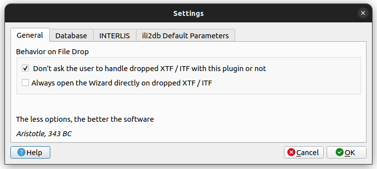
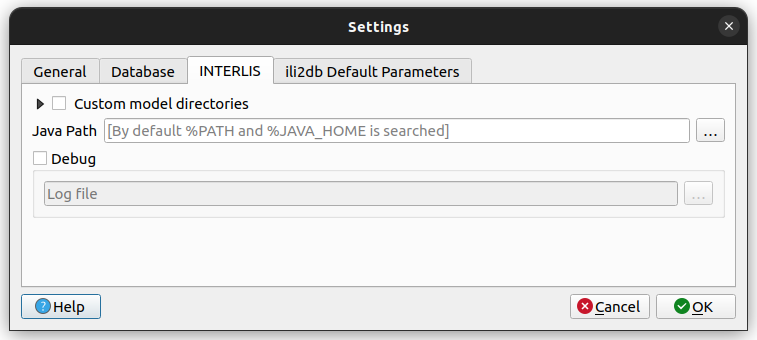
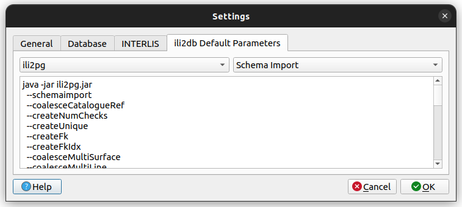

Go to menu *Database > Model Baker > Settings*.

## General Settings

In keeping with aristotle, unnecessary settings are avoided. Still there are some.

The *checkbox* is to avoid / enforce opening a popup when dropping XTF/ITF or ILI files in QGIS main window to ask if you want to handle them in the Model Baker or not.

The second is to skip the dialog asking you to import the file directly with Quick Viewer.

## Database Settings

In the *Database Login* you can set username and password to use it as superuser login to excecute data management tasks.

The button *Generally used custom DB parameters* provides you a map to enter specific parameters passed to ili2db via a temporary file to `--dbparams`.
These settings are used on every ili2pg command (including validation). They are not considered in the QGIS project. The possible parameters are described in the respective [JDBC driver](https://jdbc.postgresql.org/documentation/use/#connection-parameters).

## INTERLIS Settings

### Custom Model Directories

In this window you can set one or several paths to let ili2db where to find your INTERLIS models (ili files). Paths can be both local directories or URLs to remote model repositories. Several paths should be separated by semicolons.

By default, ili2db uses `%ILI_FROM_DB;%XTF_DIR;http://models.interlis.ch/;%JAR_DIR`, where:

-  `%ILI_FROM_DB` is a placeholder for the models in the database (in table t_ili2db_model),
-  `%XTF_DIR` is a placeholder for the directory with the transfer file,
-  `%JAR_DIR` is a placeholder for the ili2db program (ili2pg.jar or ili2gpkg.jar file).

### Java Path

By default, Model Baker searches for Java executable in `%JAVA_HOME` environment variable. However, you can overwrite such behavior by setting a custom path to Java executable file in this window. This is useful, for instance, when environment variables are not well set and you have no rights to set them in your machine's operating system.

## ili2db Command Information

This section is to show all the parameters set by the Model Baker Library per default on ili2db commands. In the plugin they are modified.
