Model Baker offers a powerful set of algorithms to process ili2db jobs. Furthermore, there are some utility algorithms, like creating baskets or getting the database parameters from a layer.

This chapter describes the general working principles of the Model Baker algorithms, explains each one individually and shows a practical processing model example using the QGIS Model Designer.

## General

While many QGIS algorithms offer complex widgets to set configurations, Model Baker algorithms provide a **straightforward list of string parameters**. Sometimes these are convenienced by enumerations, file managers or checkboxes, but mostly they are free text. This lets you use the individual algorithms very flexibly in graphical model workflows.

The algorithms use the Model Baker Library in the backend. They offer the **same options and behaviors** as Model Baker does as a plugin. In addition, **general configurations** like custom model directories are concerned and can be adjusted through the global Model Baker settings.

There are three types of algorithms: the ili2db job algorithms, the database algorithms and the utils to be used in the QGIS Model Designer.

## Algorithms

### ili2db Algorithms

Found in group *Model Baker > ili2db*

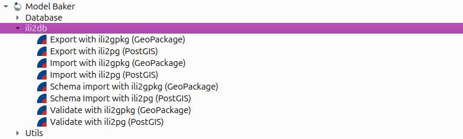

#### Import INTERLIS models with ili2db

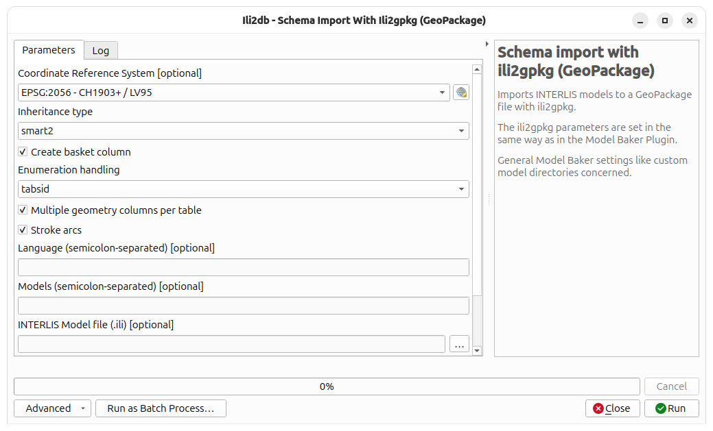

The settings are the same as those that can be set among other places in the [Advanced Options](import_workflow/#ili2db-settings) in the wizard.

#### Imports data with ili2pg

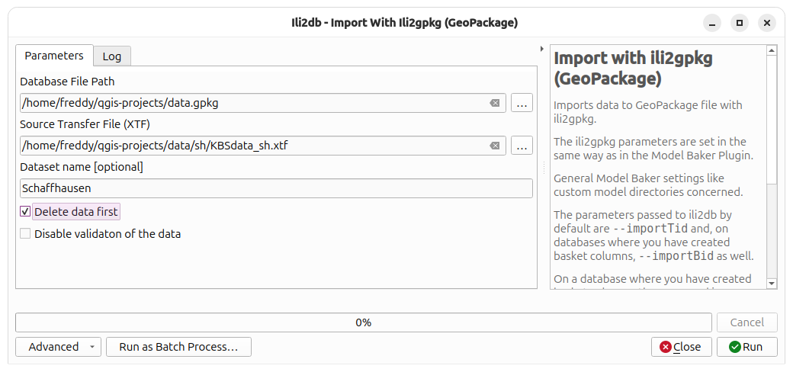

The parameters passed to ili2db by default are `--importTid` and, on databases where you have created basket columns, `--importBid` as well. On a database where you have created basket columns, the command is `--update` (or `--replace` when you choose to delete data first). You also need to define a dataset name for the import on such databases.

#### Export data with ili2db

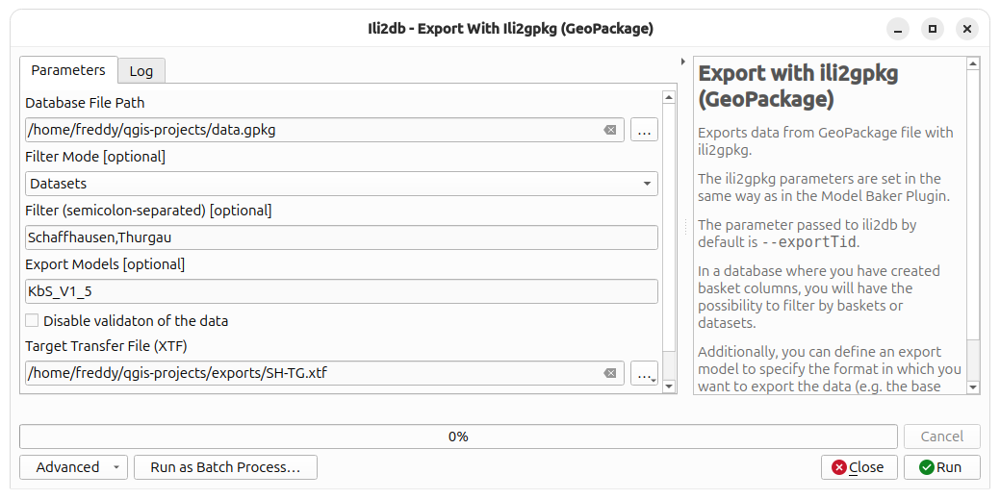

The parameter passed to ili2db by default is `--exportTid`. In a database where you have created basket columns, you will be able to filter by baskets or datasets. You can also define an export model to specify the format in which you want to export the data (e.g. the base model of your extended model).

#### Validate database with ili2db

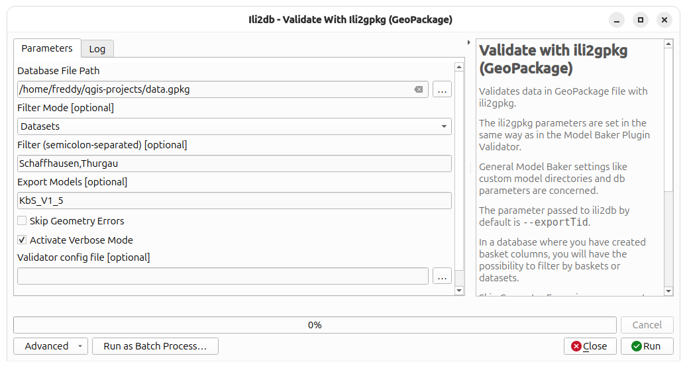

The parameter passed to ili2db by default is `--exportTid`. In a database where you have created basket columns, you will be able to filter by baskets or datasets. **Skip Geometry Errors** ignores geometry errors (`--skipGeometryErrors`) and AREA topology validation (`--disableAreaValidation`) and the **verbose mode** provides you more information in the log output. You can also define an export model to specify the format in which you want to validate the data (e.g. the base model of your extended model). You can also add a validator config file to control the validation.

This algorithm returns a path to the resulting XTF file, which you can use to analyze your validation feedback.

### Database Algorithms

Found in group *Model Baker > Database*

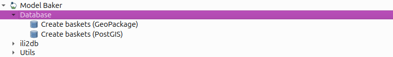

#### Create Baskets

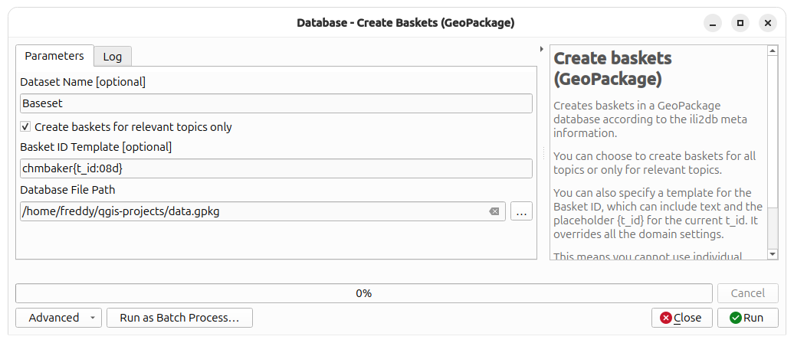

Creates baskets in a database according to the ili2db meta information. You can choose to create baskets for all topics or only for relevant topics. You can also specify a template for the Basket ID, which can include text and the placeholder {t_id} for the current t_id. It overrides all the domain settings. This means you cannot use individual templates for different topics, but you can use the same template for all topics.

### Utils

Found in group *Model Baker > Utils*

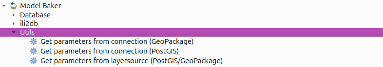

These parameters are used for processing models in the QGIS Model Designer.

#### Get parameters from layersource

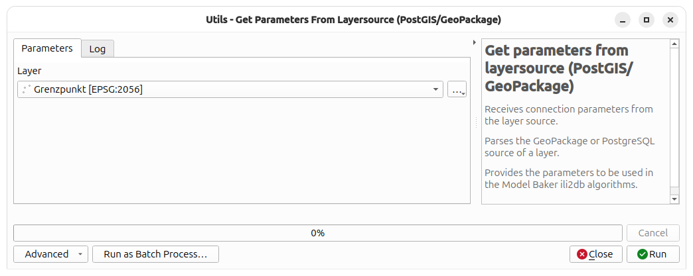

Parses the data source of a layer for the database parameters to be used in the Model Baker ili2db algorithms. This algorithm considers GeoPackage and PostgreSQL sources. It just returns what it finds.

#### Get parameters from connection

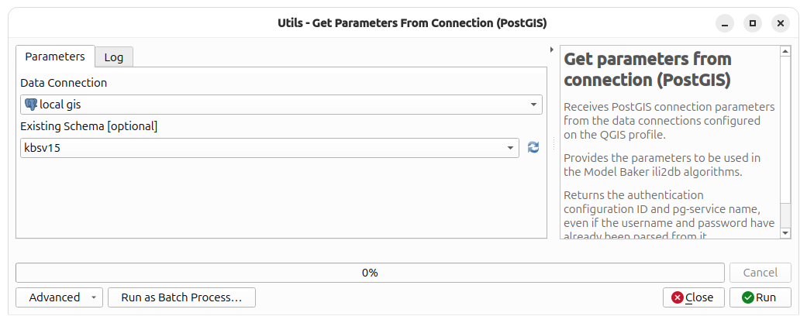

Parses the connection configured in the Data Source Manager for the database parameters to be used in the Model Baker ili2db algorithms. It also returns the authentication configuration ID and pg-service name, even if the username and password have already been parsed from it.

## Processing Model Example

### Use Case - Export an XTF of a Subset

We have a dataset available as an XTF and want a fully valid subset of it.

In this case we have the [water space data](../data/Gewaesserraum_V1_1__ZH_14.xtf) of the Canton of Zurich. We want to easily export a subset that only contains the water spaces of a specific water body.

!!! Note
    For those who are not in the topic. Water space encompasses areas that secure the natural functions of water bodies, flood protection, and water body use. These data are freely [accessible](https://www.geodienste.ch/services/gewaesserraum).

The GUI should look like this.

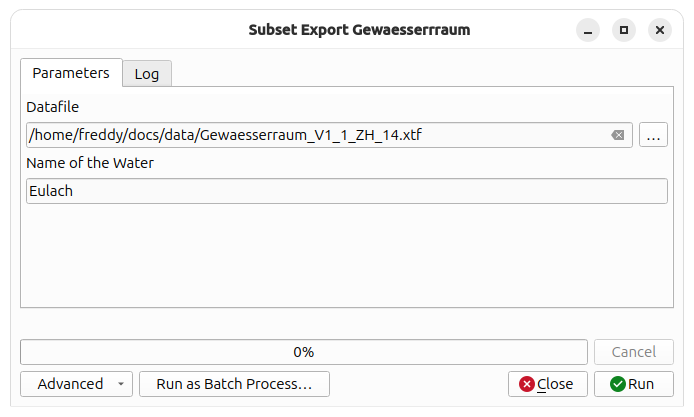

And the result should be an xtf file in the temporary folder.

The Processing Model in the following steps does not need any layers in the project. If you still want to show the results as layers, then see the note under **Feature Filter**. This are the source data around the city of Winterthur.

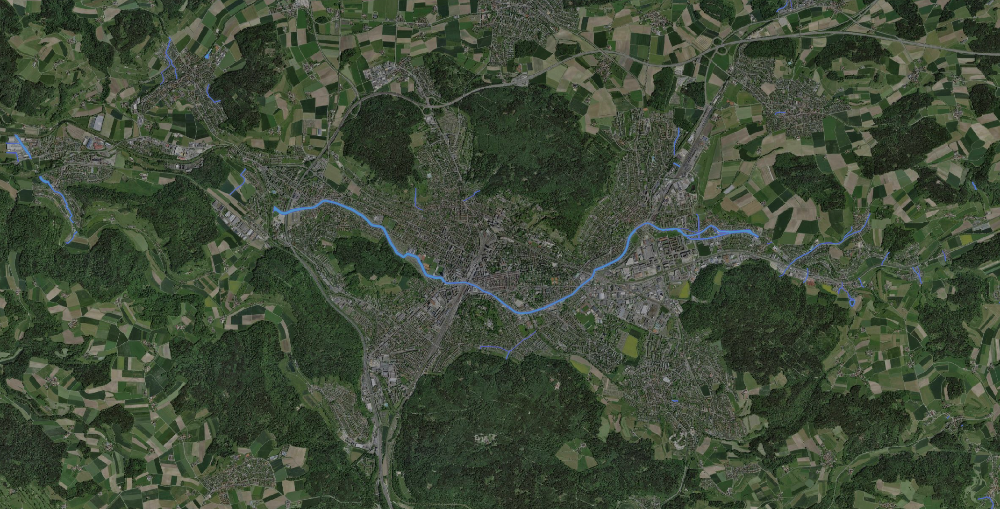

### Build the processing model

Let's create a processing model with the QGIS Model Designer that offers us all the Model Baker algorithms.

We open it in the menu: *Processing > Model Designer*

#### 1. Import the Model

First we need the data in a GeoPackage. Before we can have that we need to import the INTERLIS model.

For that we need the algorithm **Create Schema with ili2gpkg (GeoPackage)**.

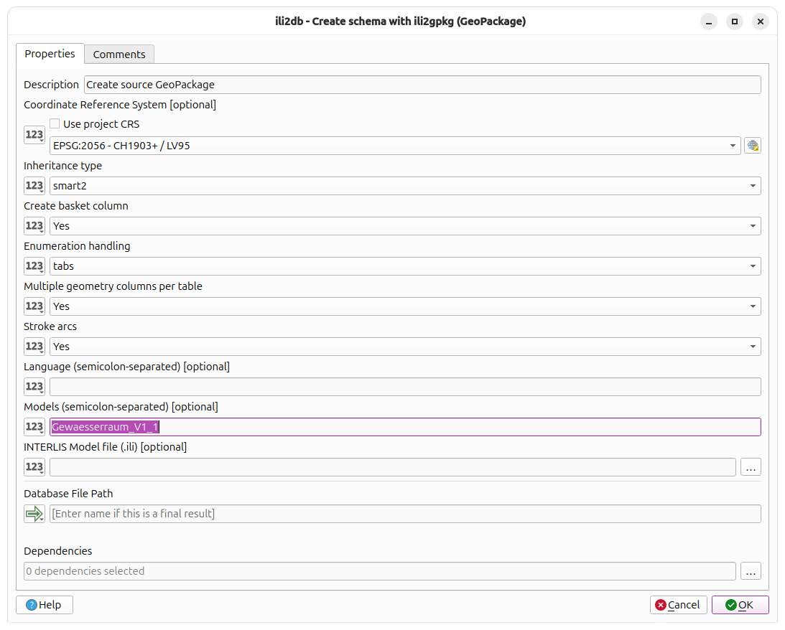

- We name it `Create source GeoPackage`
- As *Enumeration handling* we choose `tabs`. This makes data migration easier because it stores the enumeration values directly in the field
- As *Model* we enter `Gewaesserraum_V1_1`. This will find the model in the repositories.

#### 2. Import the Data

To select the data from individual sources, we add an **Input Parameter** of the `File/Folder` type.

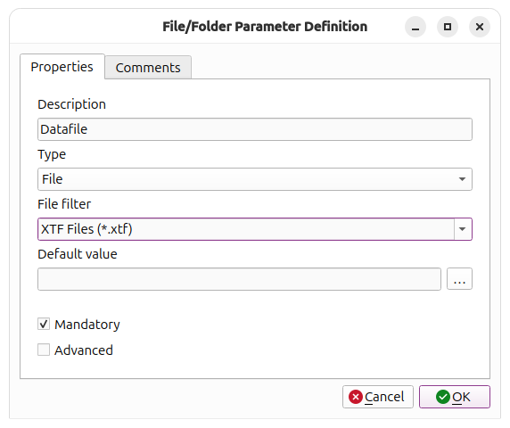

- We name it `Datafile`
- As *File filter* we edit it to `XTF Files (*.xtf)` to allow only XTF files in the selection

We add the algorithm **Import with ili2gpkg (GeoPackage)**

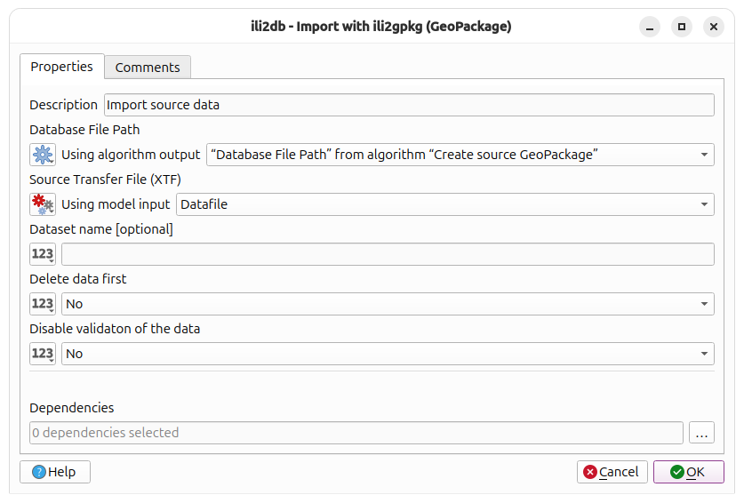

- As the *Database File Path* we take the algorithm output `Database File Path` from the algorithm "Create Source GeoPackage"
- The *Source Transfer File* should be taken from the model input `Datafile`.

#### 3. Feature Filter

Now we need to filter the feature. Lucky for us, it's enough to filter only one layer. But you can filter several tables that depend on each other with a Processing Model. It's just more complex and not suitable for a simple example.

We need another **Input Parameter** to define the water name of the type `String`.

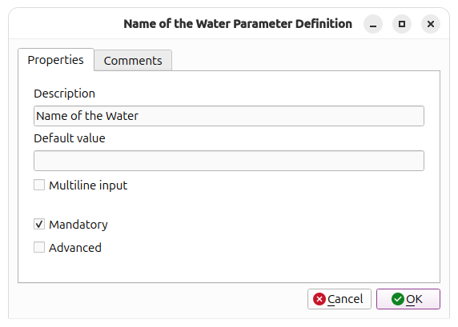

We name it accordingly.

Then we use the QGIS native algorithm called **Feature Filter**.

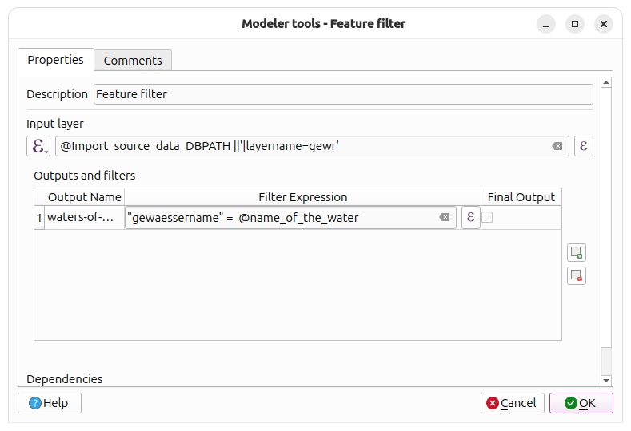

- We define the *Input Layer* as a pre-calculated value with an expression: ` @Import_source_data_DBPATH||'|layername=gewr'`. This means we don't have to load the layer into QGIS, but can read it from the GeoPackage (provided by the outputs of the previous algorithms) and append the layername to it. With PostGIS this would work differently.
- We add the filter `waters-of-interest` and define the filter expression `"gewaessername" =  @name_of_the_water`. "name_of_the_water" is a variable we can use once the Input Parameter is defined.

Now we already have a small Processing Model that would fully work.

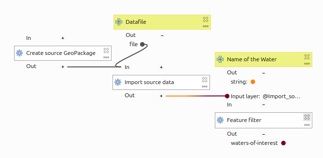

We could define it as *Final Output* and would receive the water spaces of "Eulach" (or whatever water name we enter) in QGIS.

!!! Note
    If you want to check if you do everything right, you can use the algorithm **Load Layer into Project** and define the layer as a pre-calculated value, like e.g. for the original data layer ` @Import_source_data_DBPATH ||'|layername=gewr'`

#### 4. Import the Model (again)

The plan now is to put the filtered model into a fresh GeoPackage based on the same INTERLIS Model and then export it from there. For this, we need to create a second GeoPackage.

Again we take the algorithm **Create Schema with ili2gpkg (GeoPackage)**.

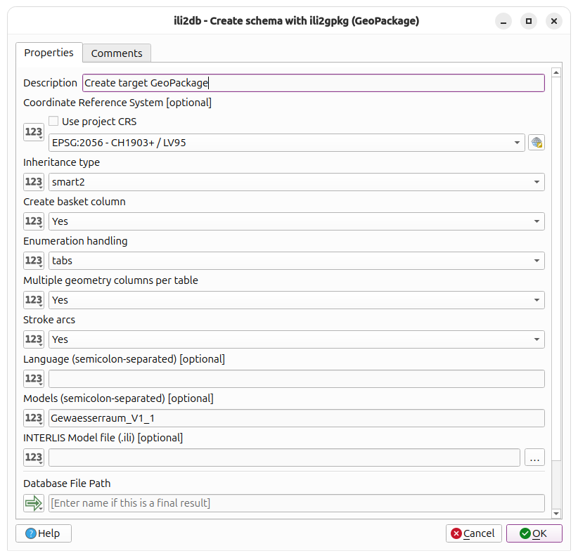

- We name it `Create target GeoPackage`
- As *Enumeration handling* we choose `tabs`. This makes data migration easier because it stores the enumeration values directly in the field
- As *Model* we enter `Gewaesserraum_V1_1`. This will find the model in the repositories.

#### 5. Create the baskets

Because we do not import the data we have to create the baskets on the target GeoPackage.

For this we have the algorithm **Create baskets (GeoPackage)**.

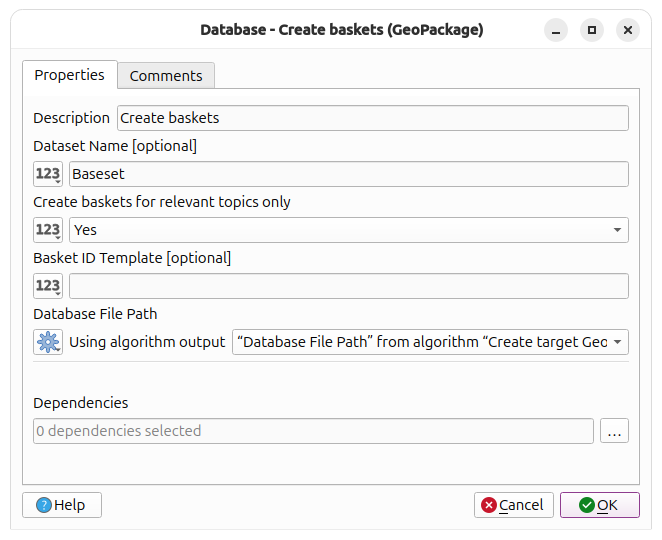

- As the *Database File Path* we take the algorithm output `Database File Path` from the algorithm "Create Target GeoPackage"

#### 6. Refactor Fields

In other models the big work would start now. The re-mapping of foreign keys to other objects or catalogue values. In our model here we only have one issue with foreign keys: the IDs of the baskets

!!! Note
    Actually this would not even be an issue on this particular model, because it does not require baskets. But because we already created them, we want to use them.

To have the correct baskets we need to add its `T_Id` to the filtered data as a foreign key. We do this with the algorithm **Refactor Fields**.

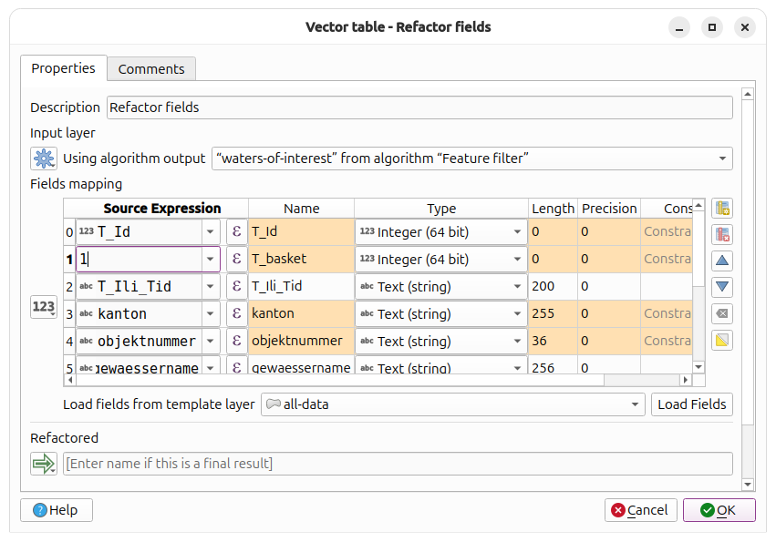

- As the **Input Layer** we take the algorithm output `waters-of-interest`
- We can load the fields from a generated layer or enter them manually.
- Now we have to set something for the **T_basket** field. The simplest would be to enter just `1` because in this case we know that it will have this `T_Id`, but we could get it with more complex expressions as well, like
    ```
    attribute(
        get_feature(
            'basket-table',
            'topic',
            'Gewaesserraum_V1_1.GewR' -- the topic of this class
        ),'T_Id'
    )
    ```

#### 7. Save the features

Now we have to save the filtered and refactored features to the target GeoPackage.

We use the algorithm **Save vector features to file**.

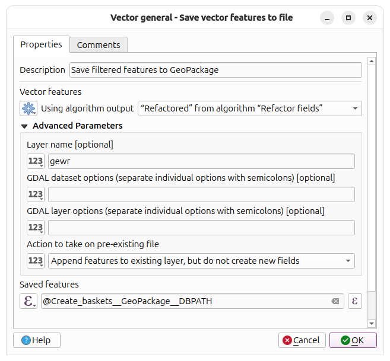

- As the **features** source we choose the algorithm output `Refactored`
- In the **layer name** we have to define the table name. It's `gewr`
- Then we have to choose the **action** `Append features to existing layer, but do not create new fields`
- And the target for the **saved features** should be our target GeoPackage. This means we take the variable `@Create_baskets__GeoPackage__DBPATH` as a pre-calculated value

Now we have the filtered data in an INTERLIS based GeoPackage. The Processing Model looks like this:

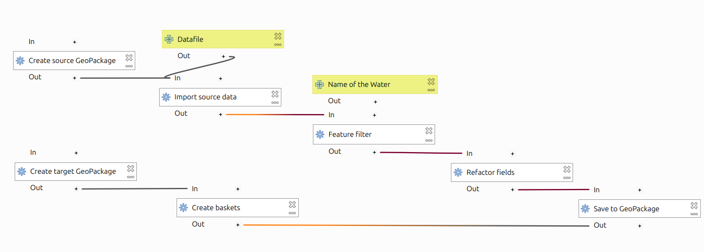

But there is one pitfall. To "Save to GeoPackage" (or if we get the Basket's T_Id with an expression, already in "Refactor fields") we need to be sure the target GeoPackage already exists. It works perfectly now, because it takes longer to import the data of the Canton of Zurich than to create the baskets, but to be sure we introduce a dependency. We do that in the "Refactor fields" algorithm.

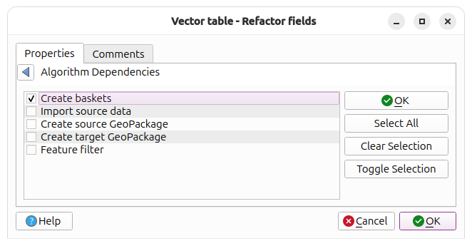

#### 8. Validate the subset

Now we want to be sure that our subset is valid. For this we use the algorithm **Validate with ili2gpkg**.

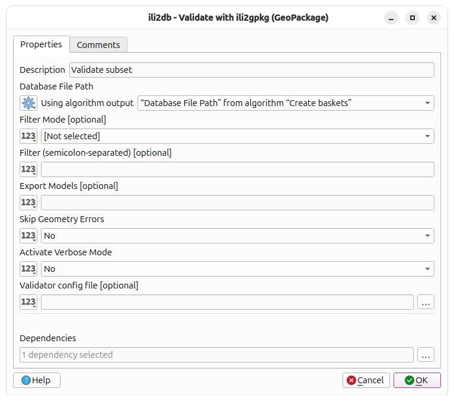

- As the **Database File Path** we choose again the algorithm output `Database File Path` from the algorithm "Create baskets"
- And we configure a dependency from the "Save to GeoPackage" (because otherwise it validates the GeoPackage before the new features have been saved)

#### 9. Export the subset

And finally we export the subset using the **Export with ili2gpkg** algorithm. Of course because of this we would not have needed the step with the validation, except when we want to export the subset even when it's invalid but get the information that it would not be valid.

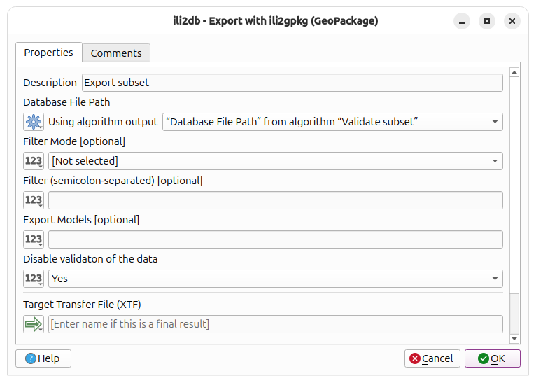

- As the **Database File Path** we choose the algorithm output `Database File Path` from the algorithm "Validate subset"

#### Result

And this is how it finally looks.

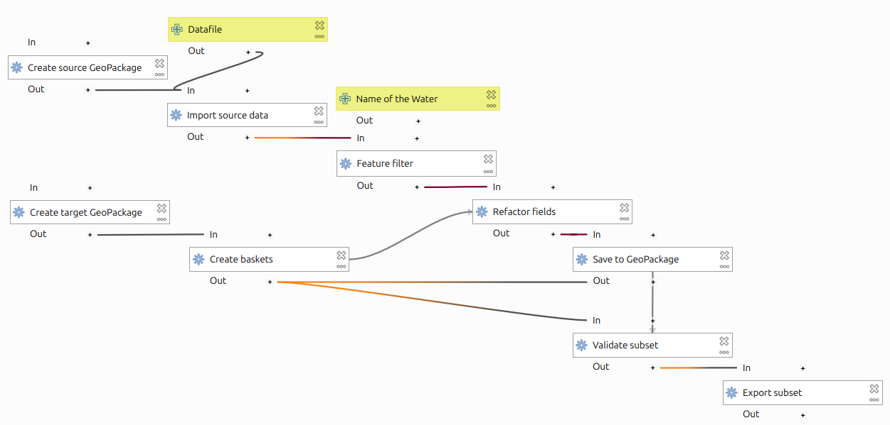

- Create first GeoPackage
- Import the data
- Filter the data to a subset
- Get BID for the subset
- Create second GeoPackage
- Create baskets in the second GeoPackage
- Save the subset into the second GeoPackage
- Validate and Export the subset
- Done

Amd as a layer it looks like this.

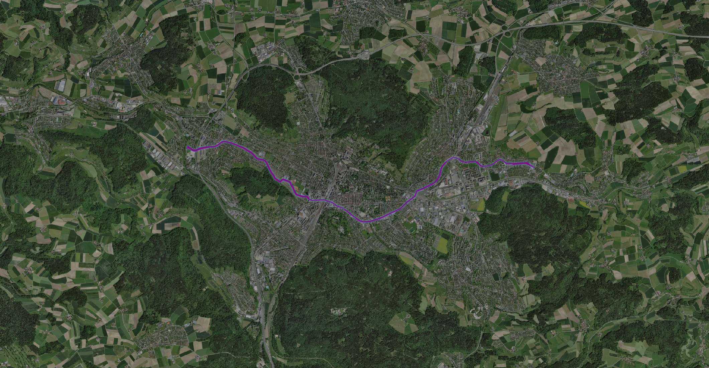

To try it yourself, you can find the data [here](../data/Gewaesserraum_V1_1__ZH_14.xtf) and model [here](../data/subset-water.model3).
