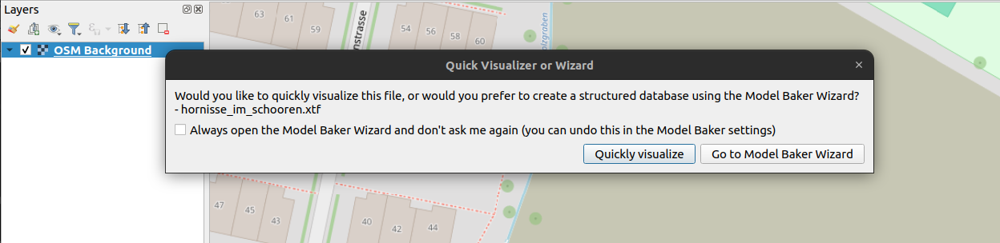
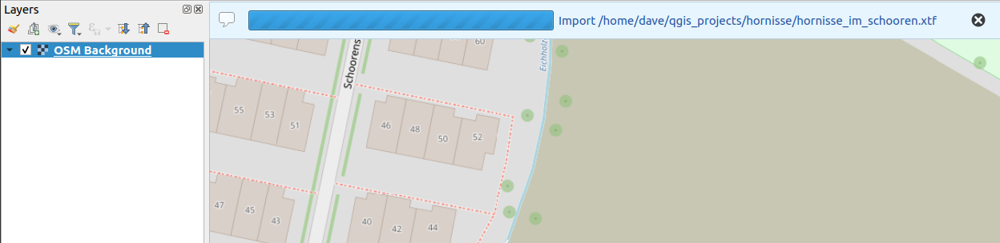
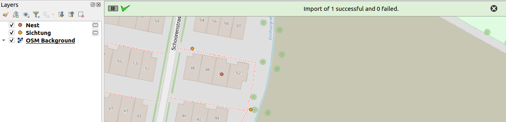
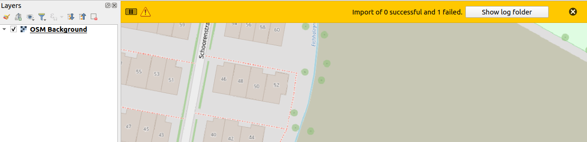
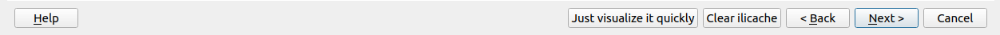

The quick visualizer feature lets you instantly view your data—whether it’s valid or not.

## Why Quick Visualizer?

Since the GDAL driver does not support INTERLIS 2.4 and thus the simple drag-and-drop in QGIS to view the data from an XTF is no longer provided, the quick visualizer fills this gap.

It generates a GeoPackage in the temporary directory without constraints and imports the data without any validation.

!!! Note
    If no configuration is made for custom model repositories, the models are collected from the usual http://model.interlis.ch and the xtf directory (the directory from which the stored files originate). If there is a custom model directory, it checks this and, if it does not find the model, automatically adds the xtf directory.

## Step-by-Step

When dropping files, besides the dialog asking whether you generally want to open such files with Model Baker, the following dialog appears:

Here you can decide to use the "normal" Wizard to continue or to visualize your data quickly. If you decide to visualize quickly, the files are imported (without constraints and validations) and the layers are created.

You get the status in the message bar.

And finally the feedback.

Or if there are troubles (like e.g. no model available), you get a negative feedback with a button to check the log files.

If you choose to use the wizard (or you opened the wizard manually (without dropping files)) you still can start the Quick Visualizer with the newly added button.

!!! Note
    This means, if you mostly use the wizard and get annoyed by the first dialog, you can select there *always open wizard* and you will come directly to the wizard on file drop and you still have the posility to quickly visualize.
