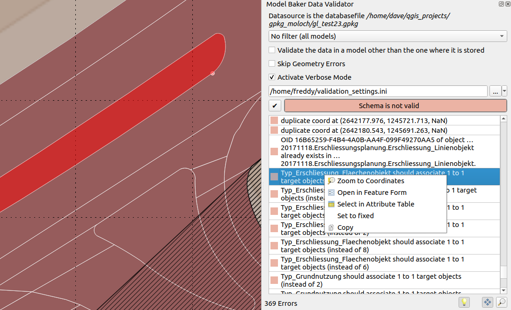
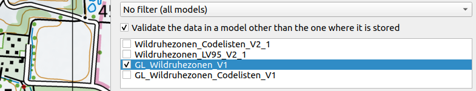
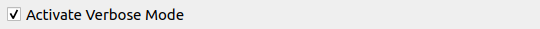

You can validate your physical data against the INTERLIS models directly in QGIS. Open the Model Baker Validator Panel by the menu *Database > Model Baker > Data Validator* or *View > Panels > Model Baker Data Validator*



## Database

The database connection parameter are emitted from the currently selected layer. Mostly this is representative for the whole project, since mostly a project bases on one single database schema/file. In case of multiple used database sources, it's possible to *switch* between the validation results when switching the layers.

## Filters

You can filter the data being validated *either* by models *or* - if the database considers [Dataset and Basket Handling](../../background_info/basket_handling/) - by datasets *or* baskets. You can choose multiple models/datasets/baskets. But only one kind of filter (`--model`, `--dataset`, `--basket`) is given to the ili2db command (it would make no conjunction (AND) but a disjunction (OR) if multiple parameters are given (what is not really used). A conjunction can still be done by selecting the smallest instance (baskets)).

## Validate in the base model

This is relevant if you use *extended* models: You have your data stored in your extended model, but might want to validate it in the *format* of the base model only.



## Skip Geometry Errors


When the checkbox is activated, geometry errors are ignored and the validation of AREA topology is disabled. Errors like those will not be listed.

- Intersecting geometries
- Duplicate coordinates
- Overlaying geometries

!!! Note
    In the backend the parameters `--skipGeometryErrors` and `--disableAreaValidation` are set.

## Verbose Mode



Activate verbose mode to get more (mostly technical) information in the error messages.

## Configuration File

It's possible to enable/disable and name constraints of the current model via meta attributes. For the configuration of those, see the chapter [Set Meta Attributes in the Config File](#set-meta-attributes-in-the-config-file) below.

Add it to the validation by selecting it via file browser.


You can save this path to your project (to the project variables) with the  botton. Althoug it's saved relatively, it's passed to ili2db as an absolute path.

!!! Note
    You can also use a configuration file from the [ilidata repositories](../../background_info/toppings/technical_concept). Just add the ilidata-key (like `ilidata:<key>`) as the path.

## Results

After running the validation by pressing the  the results are listed.

With *right click* on the error a menu is opened with the following options:

- Zoom to coordinates (if coordinates are provided) with an extend of 10 map units
- Open in Feature Form (if a stable t_ili_tid is available)
- Select in Attribute Table (if a stable t_ili_tid is available)
- Mark as fixed (marking the entry mark green and crossed over to have organize the fixing process)
- Copy (to copy the message text)

Automatic pan, zoom and highlight features or coordinates are performed by clicking on the result tables entry.
On automatic pan and zoom, the coordinates are taken into account if they are provided by ili2db, if not, then the geometry of the feature (according to the OID provided by ili2db). On automatic zoom on the features geometry, it's extent is taken and on coordinates an extend of 10 map units instead.

!!! Note
    Since ili2db sometimes on non-geometry errors provides the coordinates as well, there could be a confusion when it zooms or pans to the coordinates there. Still it's preferable to not zoom or pan to the coordinates on geometry errors when they provide an OID. Currently the validator cannot make a difference between those error-types.

## Using of Meta Attributes in the Validation

As well as configuring [meta attributes](../../background_info/meta_attributes/) used for the physical database implementation and for QGIS project generation, meta attributes can be used for additional configuration of the validation like e.g. disable specific checks generally or on specific objects as well as naming of the constraints.

### Set Meta Attributes in the ILI File

See this example:

```
[...]
    CLASS Resident =
      !!a mandatory constraint that is deactivated
      !!@ ilivalid.multiplicity = off
      ID: MANDATORY TEXT;
      Name: TEXT;
      IsHuman: BOOLEAN;
      !!a logical constraint that is deactivated
      !!@ ilivalid.check = off
      SET CONSTRAINT WHERE IsHuman:
        DEFINED(Name);
    END Resident;
[...]
```

Neither the mandatory constraint on ID nor the logical constraint will not be considered in the validation.

As well you can override message / name of logical constraints:

```
[...]
      !!@ name = MandatoryHumanName
      !!@ ilivalid.msg = "When the resident {ID} is human, then it needs a name."
      SET CONSTRAINT WHERE IsHuman:
        DEFINED(Name);
[...]
```

!!! Note
    When the `ilivalid.msg` is defined, the `name` is not displayed in the Model Baker validator.

See all the possible meta attributes in the official [documentation of ilivalidator](https://github.com/claeis/ilivalidator/blob/master/docs/ilivalidator.rst#interlis-metaattribute).

### Set Meta Attributes in the Config File

Since mostly the person validating the data is not the same than the person creating the model, there is the possiblity to pass meta attributes to the validation by an INI file.

Having the class in the INTERLIS model:

```
MODEL ModernCity_V1 (en) =
  TOPIC Living =
    CLASS Resident =
      ID: MANDATORY TEXT;
      Name: TEXT;
      IsHuman: BOOLEAN;
      SET CONSTRAINT WHERE IsHuman:
        DEFINED(Name);
    END Resident;
[...]
```

And the meta attribute from the example above in the configuration file:

```ini
["ModernCity_V1.Living.Resident.ID"]
# disable mandatory constraint of ID
multiplicity="off"

["ModernCity_V1.Living.Resident.Constraint1"]
# disable first logical constraint of class Resident
check="off"
```

!!! Note
    As well as setting them to `off` you can use `on` to reactivate the constraint (if disabled in the INTERLIS model) or use `warning`.

You can set the message of the constraints in the configuration file as well:

```ini
["ModernCity_V1.Living.Resident.Constraint1"]
msg = "When the resident {ID} is human, then it needs a name."
```

When you have a name set in the model, you can use it here:

```ini
["ModernCity_V1.Living.Resident.MandatoryHumanName"]
msg = "When the resident {ID} is human, then it needs a name."
```

Use the meta attributes listed here [documentation of ilivalidator](https://github.com/claeis/ilivalidator/blob/master/docs/ilivalidator.rst#interlis-metaattribute)  without the `ilivalid.` prefix.

### Disable Checks generally in the Config File

Sometimes it can be helpfull to disable checks generally, to make seperate validations for each kind of check.

Use for that the `"PARAMETER"` section:

```ini
["PARAMETER"]
#deactivate full validation
#validation="off"

#deactivates mandatory constraints
multiplicity="off"

#deactivates logical constraints
constraintValidation="off"
```

See for all the global configurations the official [documentation of ilivalidator](https://github.com/claeis/ilivalidator/blob/master/docs/ilivalidator.rst#ini-globale-konfigurationen).


!!! Note
    Validation with deactivated validation is useful because it checks if everything is ok with the technical aspects (like `t_typ`, `t_id` etc).

## ili2db with `--validate` in the background

On running the validation `ili2db` is used in the background with the parameter `--validate`. This means no export of the data is needed. The output is parsed by Model Baker and provided in the result list.

Entries of the type `Error` and `Warning` are listed.

## ili2db with `--plugins` in the background

In very special cases, ili2db plugins are used to validate with additional and non-native validation functions. If you have such plugins, you have to store them in your QGIS profile folder, next to the ili2db JAR file. E.g.:

```
...your-profile/python/plugins/QgisModelBaker/libs/modelbaker/iliwrapper/bin/ili2pg-5.4.0/
```
